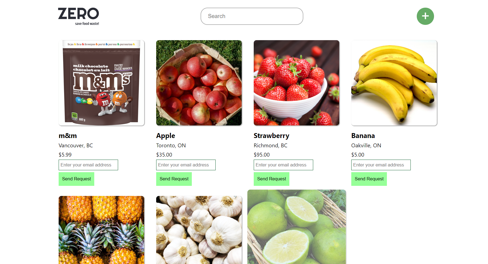
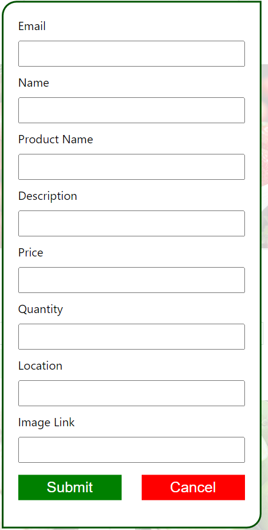

# Zero Waste Platform

## Overview
The Zero Waste Platform is a web application aimed at reducing food waste by facilitating the exchange of lower quality or almost expired products directly from local farmers to consumers. It provides a platform for farmers to upload their surplus produce and for users to browse and express interest in these products. The platform automates the communication process, enabling seamless connections between farmers and interested consumers via email.

## Technologies Used
- JavaScript
- React
- Flask
- CSS
- HTML

## Features
- **Product Upload:** Farmers can upload details of surplus produce, including descriptions, quantities, and locations.
- **User Interaction:** Users can browse available products, express interest, and connect with farmers.
- **Automated Email:** The platform automatically sends emails to farmers when users express interest in their products, facilitating communication between parties.

## Contributors
- Winnie Hsiang 
- Izabella Yu
- Michael Mo
- jing Yu

